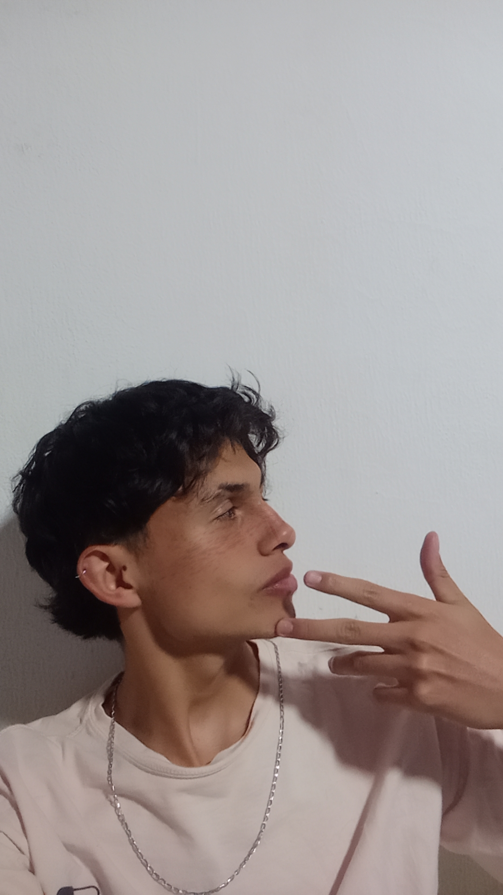

<html lang="es">
<head>
  <meta charset="UTF-8" />
  <meta name="viewport" content="width=device-width, initial-scale=1" />
  <meta name="description" content="Perspectiva: Opinión y noticias del fútbol desde otro ángulo." />
  <link href="https://fonts.googleapis.com/css2?family=Poppins:wght@400;600;800&display=swap" rel="stylesheet">
  
</head>
<body>

  <!-- Header -->
  <header>
    

      
⚽ Perspectiva

      <nav>
        <a href="#inicio">Inicio</a>
        <a href="#opiniones">Opiniones</a>
        <a href="#internacional">Internacional</a>
        <a href="#colombiano">Colombiano</a>
        <a href="#sobre-mi">Sobre mí</a>
        <a href="#contacto">Contacto</a>
      </nav>
    

  </header>

  <!-- Opinión destacada -->
  <section class="destacada">
    <article>
      
      

        
20 de agosto de 2025 Copa Sudamericana

        <h3>🚨 Incidentes en el partido Independiente vs Universidad de Chile</h3>
        
El partido entre Independiente y Universidad de Chile prometía ser un duelo intenso de fútbol sudamericano… pero lo que ocurrió superó cualquier expectativa. Entre goles, emoción y tensión, las gradas se convirtieron en un escenario de caos que dejó a todos con la boca abierta. ¿Qué pasó realmente en ese enfrentamiento que terminó suspendido y con graves consecuencias?

        <a href="#" class="readmore">Seguir leyendo →</a>
      

    </article>
  </section>

  <!-- Contenido principal -->
  <main>
    <!-- Noticias/opiniones -->
    <section id="opiniones" class="grid">
      <!-- Aquí van todos tus artículos -->
<article>
  
  

    
20 de agosto de 2025 Liga BetPlay

    <h2>🔵👟 “Comunidad se queda sin Zapatos Tras protesta en el Campin: Millonarios en Crisis”</h2>
    

    <a href="#" class="readmore">Seguir leyendo →</a>
  

</article>

   
    </section>

    <!-- Sidebar -->
    <aside>
      <h3>📰 Opiniones destacadas</h3>
      <ul>
        <li><a href="#">🚨 Incidentes en el partido Independiente vs Universidad de Chile</a></li>
        <li><a href="#">🔵👟 “Comunidad se queda sin Zapatos Tras protesta en el Campin: Millonarios en Crisis”</a></li>
        <li></li>
      </ul>
    </aside>
  </main>

  <!-- Sobre mí -->
  <section id="sobre-mi" class="sobre-mi">

    
    <h2>Sobre mí</h2>
    
👋 Hola, soy Jesus Rojas, un apasionado del fútbol y creador de Perspectiva. Desde joven, me ha fascinado analizar tácticas, seguir la actualidad de equipos y jugadores, y compartir opiniones fundamentadas sobre lo que sucede dentro y fuera de la cancha.

En este espacio encontrarás noticias, análisis y opiniones sobre fútbol colombiano e internacional. Mi objetivo es ofrecer un punto de vista claro, cercano y que genere conversación, porque creo que el fútbol se disfruta más cuando se comparte y se debate con respeto.

    
  </section>

  <!-- Contacto -->
  <section id="contacto" class="contacto">
    <h2>📩 Contáctame</h2>
    
¿Tienes una opinión, sugerencia o quieres debatir de fútbol? Escríbeme aquí:

    <form class="contact-form">
      <label for="nombre">Nombre:</label>
      <input type="text" id="nombre" name="nombre" required placeholder="Tu nombre">
      <label for="correo">Correo electrónico:</label>
      <input type="email" id="correo" name="correo" required placeholder="tunombre@email.com">
      <label for="mensaje">Mensaje:</label>
      <textarea id="mensaje" name="mensaje" rows="5" required placeholder="Escribe tu mensaje aquí..."></textarea>
      <button type="submit">Enviar</button>
    </form>
  </section>

  <!-- Footer -->
  <footer>
    
© 2025 Perspectiva

  </footer>

</body>
</html>
